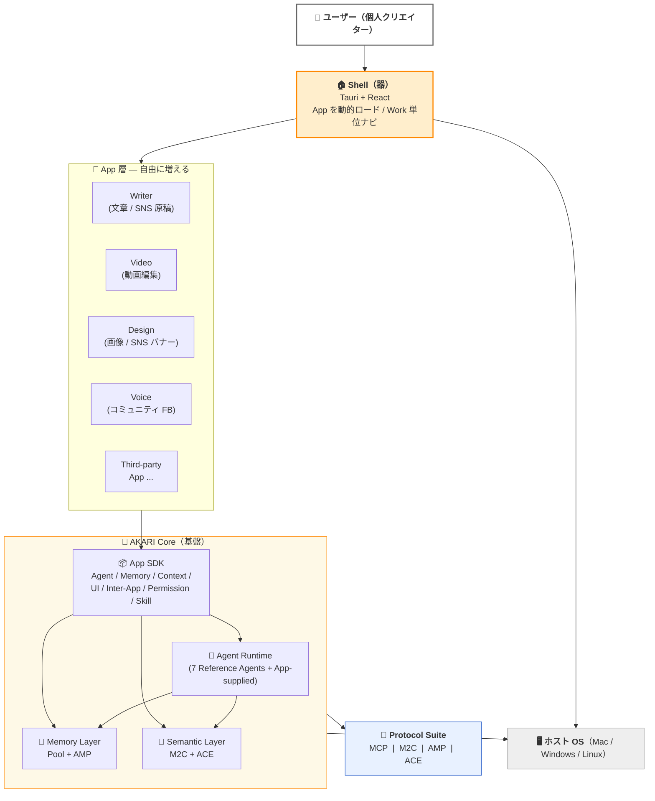

# AKARI 概念マップ

> **正典 (Layer A)**: 本ディレクトリは AKARI Onboarding の公開正典です。
> Hub (`akari-os/docs/onboarding/`) は同期コピー（編集は本ディレクトリで行う）。
>
> **対象読者**: AKARI を初めて触る全員（訪問者 / エンドユーザー / 開発者共通）
> **所要時間**: 10 分（図 + 概念解説 + 関係図）
> **前提知識**: 不要
> **次に読むもの**: [`glossary.md`](./glossary.md)（用語集）→ 自分の立場に合った Quickstart

---

これは AKARI エコシステム全体を **1 枚絵 + 最小定義** で示すページです。
詳細は各概念の正典（spec / ADR）にリンクしています。**ここで読み切るのではなく、迷ったときの地図**として使ってください。

---

## 1. 全体像（1 枚 Mermaid）



**読み方**: ユーザーは Shell（器）を開く。Shell は App（Writer / Video / Design / …）を動的ロードする。App は **App SDK** 経由で Core 基盤（Agent / Memory / Semantic）を呼ぶ。Core 内部の通信規格は **Protocol Suite** で統一される。

---

## 2. 構成要素の最小定義

### Shell（器）

AKARI の **「器」**。Tauri v2 + React で動く 1 つのホストアプリ。
App を動的ロードし、Work（仕事の単位）ごとにタブを切り替えるナビゲーションを提供する。

> 実装: [`Akari-OS/shell`](https://github.com/Akari-OS)（段階公開）

### Pool（記憶層・素材倉庫）

全アプリ共有の **Knowledge Store**。素材（Asset）と AI 解析結果（context）の SSOT。
SQLite + FTS5 + 6 種 Analyzer + MCP サーバーから成る Rust 実装。

> 公開ドキュメント: [`Akari-OS/pool`](https://github.com/Akari-OS) / 実装: `Akari-OS/pool-impl`（段階公開）

### Work / Asset / Variant（成果物の 3 層モデル）

ユーザーの「ある仕事」を 3 層で扱う:

- **Work** — 仕事の単位（記事 1 本 / 動画 1 本 / SNS キャンペーン 1 つ）
- **Asset** — Work に投入される素材（画像 / 音 / テキスト / スライド / 引用）。**immutable**
- **Variant** — Work の最終出力フォーマット（X 投稿用 / 縦長動画 / 短文版 等）

> 概念のさらに詳しい解説は [`glossary.md`](./glossary.md) を参照。

### App（アプリ）

Shell に動的ロードされる「能力パッケージ」。UI + App-supplied Agent + MCP サーバ + Skill + Pool スキーマを同梱する。
2 つの **Tier** がある:

- **Full Tier** — ネイティブ要件あり（GPU / FFmpeg 等）。例: Writer / Video / Design
- **MCP-Declarative Tier** — MCP サーバ + `panel.schema.json` だけで Shell に載る軽量 App。例: X Sender / Figma 連携

> SDK: [`Akari-OS/sdk`](https://github.com/Akari-OS)

### Agent / Pipeline / Workflow

- **Agent** — LLM が着る「コスチューム」（システムプロンプト + コンテキスト + tool セット）。
  reference defaults として **7 人**（Partner / Studio / Operator / Researcher / Guardian / Memory / Analyst）が常駐
- **Pipeline** — Writer などが提供する **承認駆動型 4 Phase ループ**（A 設計 → B 生成 → C QA → D 公開）
- **Workflow** — Pipeline をユーザーが編集可能にした **可視化編集グラフ**

> 詳細は [`../../VISION.md`](../../VISION.md) §AKARI Core 5 層 / §AKARI App SDK を参照。

### Protocol Suite（4 つのプロトコル）

AKARI Core が依拠する OS レベル標準。

| プロトコル | 標準化対象 | リポ |
|---|---|---|
| **MCP** | ツール呼び出し | (external) [modelcontextprotocol.io](https://modelcontextprotocol.io) |
| **M2C** | メディア → コンテキスト変換 | [`Akari-OS/m2c`](https://github.com/Akari-OS) |
| **AMP** | エージェント記憶 | [`Akari-OS/amp`](https://github.com/Akari-OS) |
| **ACE** | エージェントコンテキスト + Lint | [`Akari-OS/ace`](https://github.com/Akari-OS) |

> 正典: [`../../VISION.md`](../../VISION.md) §AKARI Protocol Suite

---

## 3. 3P Loop — 意図は人、手は AI

AKARI のすべての作業は、3 つのフェーズが往復するループで進みます。

```
  ┌─────────────────────────────────────┐
  │                                     │
  ▼                                     │
  [提案 Propose]                        │
   AI が素材を読み、叩き台を出す          │
      ↓                                 │
  [方向 Point]                          │
   あなたが画面上で指し示す               │
   （選択 / D&D / 範囲指定）             │
      ↓                                 │
  [仕上げ Polish]                       │
   AI が方向通りに仕上げる                │
      └─────────────────────────────────┘
```

人間の役割は 2 つだけ — **意図の注入** と **仕上がりの確認**。
それ以外（解析・抽出・ドラフト・整形・並行生成）は AI が引き受けます。

> 正典: [`../../VISION.md`](../../VISION.md) §3P Loop

---

## 4. Pool 階層構造（並列・ネスト禁止）

```
Personal Pool（1 ユーザー = 1 つ・アンビエント）
  └ ユーザーアカウントに常時 attach（Work scope の外）
      個人の声色 / 嗜好 / ブランディング素材

Pool（並列・上限なし、pin できるのは最大 10）
  ├ Pool A: akari-os 開発
  ├ Pool B: 個人 SNS 運用
  ├ Pool C: 相模原 IoT 案件
  └ ...
```

**重要原則**:

- Pool **間** の参照は first-class（コピーせず ref で繋ぐ）
- 越境はデフォルト OFF（明示で ON）
- **Personal Pool は越境上位**（個人スタイルが他 Pool より優先）
- Pool visibility（public / private）は作成時固定 / 後変更不可（誤公開を構造的に防ぐ）

> Pool 公開仕様: [`Akari-OS/pool`](https://github.com/Akari-OS)

---

## 5. なぜ「公開正典」と「Hub」で分かれているのか（30 秒理解）

AKARI のドキュメントは 2 つの軸で整理されています。

### 軸 1: 配置層モデル（Placement Tiers）— どこに置くか

```
Layer A: Canonical (公開正典)
  → Akari-OS/.github/  ← VISION / ROADMAP / CoC / SECURITY
    世界に向けた「真実の源」（本リポ）

Layer B: Hub (ローカル作業ハブ・非公開)
  → akari-os/  ← 横断研究 / 戦略 / Master Index
    コードは置かない

Layer C: Repo-specific (各アプリ固有)
  → <repo>/docs/  ← そのリポで完結する設計・機能・計画
    自己完結。単独 clone しても読める
```

### 軸 2: 文書層モデル（Schema / Wiki / Raw）— 誰が書くか

| 層 | 実体 | 所有者 | 性質 |
|---|---|---|---|
| **Schema** | `CLAUDE.md` | 人間 | 規約・ワークフロー（不変方針） |
| **Wiki** | `INDEX.md` / 整形 doc / `reports/` | LLM が maintain 可 | Raw を参照した要約・合成 |
| **Raw** | `raw/` 配下 / 子リポでは `docs/planning/` 等 | 人間 | 一次情報（不変） |

**読者として知っておくこと**:

- 公開リポで読めるのは Layer A + Layer C の一部のみ（戦略・競合分析等は Hub に残る）
- 本オンボーディングは **Layer A 公開正典 ↔ Hub Wiki** の同期コピー関係（編集は本リポで行う）

---

## 6. もっと知るには

| 立場 | 次に読むもの |
|---|---|
| GitHub 訪問者 | [`quickstart-visitor.md`](./quickstart-visitor.md) → [Akari-OS](https://github.com/Akari-OS) |
| エンドユーザー | [`quickstart-end-user.md`](./quickstart-end-user.md) → [`../../VISION.md`](../../VISION.md) |
| 開発者 | [`quickstart-developer.md`](./quickstart-developer.md) → [`Akari-OS/sdk`](https://github.com/Akari-OS) |
| 全員 | [`glossary.md`](./glossary.md)（用語集） / [`faq.md`](./faq.md)（FAQ） |

### 詳細を追う窓口

- 🌐 Akari-OS org: [github.com/Akari-OS](https://github.com/Akari-OS)
- 📖 Vision: [`../../VISION.md`](../../VISION.md)
- 🗺 Roadmap: [`../../ROADMAP.md`](../../ROADMAP.md)
- 🧠 Memory architecture: [`../memory.md`](../memory.md)
