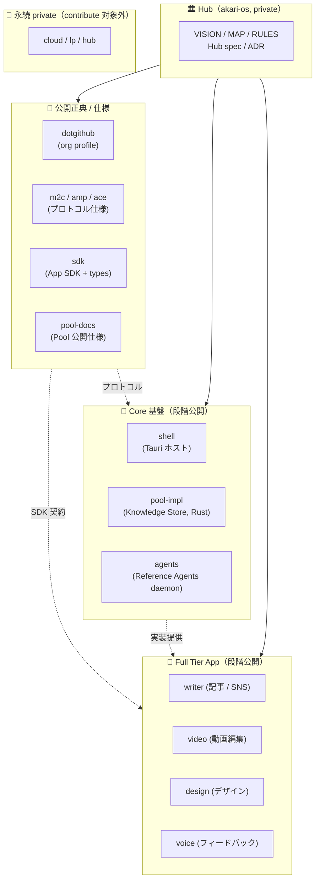

# Quickstart — 1 日で contribute する（開発者向け）

> **正典 (Layer A)**: 本ディレクトリは AKARI Onboarding の公開正典です。
> Hub (`akari-os/docs/onboarding/`) は同期コピー（編集は本ディレクトリで行う）。
>
> **対象読者**: AKARI に **コードで関わりたい開発者**
>   - **Contributor パス**: AKARI のいずれかのリポに PR を投げて mainline に取り込まれることを目指す人
>   - **App 開発者パス**: AKARI Shell 上で動く独自 App を作って配布する人
>   - **仕様 contributor パス**: M2C / AMP / ACE のプロトコル仕様改善に関わりたい人
> **所要時間**: 約 1 日（環境構築 → 最初のビルド → 最初の PR / 最初の App 起動まで）
> **前提知識**: Git / Node.js (pnpm) / 基本的な TypeScript（Rust / Tauri 触り経験あるとなお良い）
> **次に読むもの**:
>   - [`./concept-map.md`](./concept-map.md) / [`./glossary.md`](./glossary.md) / [`./faq.md`](./faq.md) — 全体像と用語
>   - [`Akari-OS/sdk`](https://github.com/Akari-OS) の `docs/getting-started.md` — App SDK で 5 分 App を作る
>   - 各リポの `docs/specs/` / `docs/adr/` — 担当範囲の正典
>   - [`../../CONTRIBUTING.md`](../../CONTRIBUTING.md) — 公開リポへの貢献規約

---

## このページの読み方

7 つの Step を**上から順に**進めると、1 日で「最初の PR」または「最初の自作 App 起動」まで到達できます。
各 Step の冒頭に **想定所要時間** を書いています。所要時間を超えたら一度休憩して [`./faq.md`](./faq.md) を覗いてください。

最後の **末尾セクション** には、ライセンス層 / 商標 / contributor サポートなど、AKARI に関わる前に知っておきたい運用情報をまとめています。

---

## Step 0: AKARI のエコシステム俯瞰（10 分）

### 一言で

> **個人クリエイターのための AI OS**。スマホに iOS があるように、クリエイター PC に AKARI OS がある。

詳しくは [`../../VISION.md`](../../VISION.md) と [`./concept-map.md`](./concept-map.md) を参照してください。本セクションでは「**コードがどこに置かれているか**」だけを把握します。

### Open Core 戦略（30 秒で）

AKARI は **4 ライセンス層**で構成される Open Core プロジェクトです。詳細は [親 README §License](../../profile/README.md) を参照。

| Layer | License | 対象 | 例 |
|---|---|---|---|
| Layer 1 | proprietary（All Rights Reserved + EULA） | 収益源 + 内部作業材料 | `cloud` / `lp` / Hub 自身 |
| Layer 2 | Apache 2.0 | 基盤コード + 標準仕様（特許防衛） | `shell` / `pool-impl` / `agents` / `m2c` / `amp` / `ace` |
| Layer 3 | MIT | SDK + Full Tier App | `sdk` / `writer` / `video` / `design` / `voice` |
| Layer 4 | CC BY 4.0 | 公開ドキュメント | `dotgithub`（本リポ） / `pool-docs` |

> contributor 視点では「**Layer 2 / 3 のリポ**は OSS、Layer 1 は contributor を募集していない」と覚えれば十分です。

### リポ構成

AKARI は **Hub + 16 兄弟リポ** で構成される multi-repo プロジェクトです。リポ一覧は [Akari-OS org](https://github.com/Akari-OS) を参照してください。



レイヤーごとの contribute しどころ：

- **基盤いじりたい人**: `akari-shell` / `akari-pool-impl` / `akari-agents`（Layer 2 / Apache 2.0）
- **App 作りたい人**: [`Akari-OS/sdk`](https://github.com/Akari-OS) を import して新規リポを建てる、または `akari-writer` / `akari-video` / `akari-design` を参考にする（Layer 3 / MIT）
- **仕様いじりたい人**: [`Akari-OS/m2c`](https://github.com/Akari-OS) / [`Akari-OS/amp`](https://github.com/Akari-OS) / [`Akari-OS/ace`](https://github.com/Akari-OS)（Layer 2 / Apache 2.0、DCO 必須）
- **公開 docs 直したい人**: [`Akari-OS/.github`](https://github.com/Akari-OS/.github)（本リポ） / [`Akari-OS/pool`](https://github.com/Akari-OS)（Layer 4 / CC BY 4.0）

---

## Step 1: 環境準備（30 分）

### 必須ツール

| ツール | バージョン | 確認コマンド | 用途 |
|---|---|---|---|
| Git | 2.30+ | `git --version` | 全リポで使用 |
| Node.js | 20+ | `node --version` | shell / sdk / app（TS） |
| pnpm | 9+ | `pnpm --version` | パッケージマネージャ（npm / yarn 不可） |
| Rust（rustup 経由） | stable | `rustc --version` | shell（Tauri）/ pool-impl |
| GitHub CLI | 2.40+ | `gh --version` | gh repo clone / gh auth login |

### macOS

```bash
# Homebrew でまとめて
brew install git node pnpm gh
curl --proto '=https' --tlsv1.2 -sSf https://sh.rustup.rs | sh
source "$HOME/.cargo/env"

# Tauri が要求する Xcode CLI Tools
xcode-select --install
```

### Linux（Ubuntu / Debian 系）

```bash
# Node 20 (NodeSource)
curl -fsSL https://deb.nodesource.com/setup_20.x | sudo bash -
sudo apt-get install -y nodejs git build-essential
sudo npm install -g pnpm

# Rust
curl --proto '=https' --tlsv1.2 -sSf https://sh.rustup.rs | sh
source "$HOME/.cargo/env"

# Tauri が要求するシステム依存（Ubuntu の場合）
sudo apt-get install -y \
  libwebkit2gtk-4.1-dev libssl-dev libgtk-3-dev libayatana-appindicator3-dev \
  librsvg2-dev pkg-config

# GitHub CLI
sudo apt-get install -y gh
```

### Windows

> **公式サポート**: 現状 macOS / Linux で日々開発されています。Windows は WSL2（Ubuntu）での動作を推奨します（ネイティブ build は未検証）。

WSL2 内で上記 Linux 手順を実行してください。Tauri のネイティブ Windows build は将来サポート予定です。

### 認証セットアップ

```bash
gh auth login
# GitHub.com → HTTPS → Login with a web browser を選択
# Akari-OS org の private リポに read 権限が必要な場合は、別途 invite を依頼してください
```

> **任意ですが推奨**: VS Code + 拡張機能（rust-analyzer / Tauri / Biome / TypeScript）。

---

## Step 2: リポ取得と俯瞰ビュー構築（20 分）

### 作業ディレクトリの推奨構造

AKARI の各リポは `Cargo.toml` / `package.json` で **path 依存** していることが多いため、兄弟ディレクトリとして並べてください。

```
~/dev/akari/                    ← 任意のディレクトリ（例）
├── akari-sdk/
├── akari-shell/
├── akari-pool-impl/            ← 段階公開 private（要 read invite）
├── akari-amp/
├── akari-m2c/
├── akari-ace/
└── ...
```

### 必要な兄弟リポを clone

```bash
mkdir -p ~/dev/akari && cd ~/dev/akari

# 公開リポ（誰でも clone 可能）
gh repo clone Akari-OS/sdk     akari-sdk
gh repo clone Akari-OS/amp     akari-amp
gh repo clone Akari-OS/m2c     akari-m2c
gh repo clone Akari-OS/ace     akari-ace
gh repo clone Akari-OS/.github akari-dotgithub
gh repo clone Akari-OS/pool    akari-pool-docs

# 段階公開 private（read invite が必要なリポは未招待だと skip される）
gh repo clone Akari-OS/shell     akari-shell      || true
gh repo clone Akari-OS/pool-impl akari-pool-impl  || true
gh repo clone Akari-OS/agents    akari-agents     || true
```

### Akari-OS org に未招待の場合

段階公開 private（`shell` / `pool-impl` / `agents`）は **read collaborator 権限**が必要です。
公開リポ（`sdk` / `amp` / `m2c` / `ace` / `dotgithub` / `pool` docs）だけでも contribute は十分始められます。

---

## Step 3: 最初のビルド（30 分）

担当したいレイヤーに合わせて、まず 1 つビルドを通してください。**最初のビルドが通る = 環境構築完了**の合図です。

### A. SDK パッケージ（最も軽い、Layer 3 / MIT）

```bash
cd ~/dev/akari/akari-sdk
pnpm install
pnpm -r build
pnpm -r test    # 試験パッケージは現状未整備の package もあるが skip OK
```

完走すれば、`packages/sdk` / `packages/schema-panel` / `packages/app-cli` の build artefact が生成されます。

### B. Pool 実装（Rust、Layer 2 / Apache 2.0）

```bash
cd ~/dev/akari/akari-pool-impl
cargo check --all-targets
cargo test --workspace
```

> 初回ビルドは Rust の依存解決で 5〜10 分かかることがあります。crates.io キャッシュが温まれば 2 回目以降は数秒〜数十秒で済みます。

### C. Shell（Tauri アプリ、Layer 2 / Apache 2.0）

shell は **multi-repo path 依存**のため、Step 2 で `akari-pool-impl` / `akari-sdk` を clone 済みである必要があります。

```bash
cd ~/dev/akari/akari-shell
./scripts/bootstrap.sh   # 兄弟リポを揃える + pnpm install + ui kit build
pnpm tauri dev           # 初回 Rust build は 5〜10 分
```

初回起動時の挙動・Apple 署名・トラブルシューティングは shell リポの `docs/DEVELOPMENT.md` に詳しく書かれています（pointer のみ）。

### D. App SDK でサンプル App を起動（5 分、Layer 3 / MIT）

「最短で動くもの」を見たい人はこちらを推奨します。

```bash
cd ~/dev/akari/akari-sdk
pnpm -r build
pnpm --filter @akari/example-web-search dev
```

詳細チュートリアル（雛形生成 → 動作確認 → certify）は SDK の getting-started に集約されています:
**→ [`Akari-OS/sdk`](https://github.com/Akari-OS) の `docs/getting-started.md`**

### ビルドが通らないときは

- リポをまたぐ path 依存はディレクトリ位置に敏感です。`~/dev/akari/akari-*` の構造を再確認してください
- pnpm のキャッシュ汚染が疑われる場合: `rm -rf node_modules pnpm-lock.yaml && pnpm install`（最終手段）
- Rust の link error は `rustup update stable && cargo clean && cargo build` を試してください
- それでも詰まる場合は [`./faq.md`](./faq.md) と各リポの `docs/troubleshooting.md` を確認後、GitHub Issue / Discussion を立ててください

---

## Step 4: SDD ワークフローを学ぶ（30 分）

AKARI は **仕様駆動開発（SDD）** で運営されています。コードを書く前に必ず spec を読み、新規機能は spec を書いてから実装します。各リポの `docs/specs/` 配下に spec が置かれているので、**最初に該当 spec を通読**してください。

### 5 フェーズワークフロー

```
Constitution → Specify → Plan → Tasks → Implement
   (原則)     (What/Why)  (How)  (分解)   (コード)
```

| フェーズ | 担う場所 |
|---|---|
| **Constitution** | `CLAUDE.md` + `VISION.md`（既に整備済み） |
| **Specify** | `docs/specs/spec-{feature}.md`（What / Why / 受入基準） |
| **Plan** | spec 内「Architecture / Technical Approach」セクション |
| **Tasks** | spec 内「Tasks」セクション or 別 `tasks-{feature}.md` |
| **Implement** | 実装コミットメッセージに spec-id を含める |

### spec-id 体系

形式は `AKARI-{REPO}-{NNN}` で、リポごとに 3 桁ゼロ埋め連番です。

- `AKARI-HUB-024` — Hub 横断 spec（App SDK 仕様）
- `AKARI-POOL-001` — pool-impl 固有 spec
- `AKARI-WRITER-003` — writer 固有 spec
- `AKARI-VIDEO-007` — video 固有 spec

実装 commit / PR には `[spec: AKARI-XXX-NNN]` を含めて traceability を担保します。

### 既存 spec の読み方

最初の 1 本は **SDK の App SDK 仕様**を読むことを推奨します。SDK の全体像が掴めます（[`Akari-OS/sdk`](https://github.com/Akari-OS) の `docs/specs/`）。

```bash
# 各リポの spec を一覧
ls ~/dev/akari/akari-sdk/docs/specs/      2>/dev/null
ls ~/dev/akari/akari-pool-impl/docs/specs/ 2>/dev/null
ls ~/dev/akari/akari-writer/docs/specs/    2>/dev/null
```

### ADR の役割

設計判断の根拠は **ADR**（Architecture Decision Record）に残します。`ADR-{NNN}-{topic}.md` 形式で、各リポの `docs/adr/` に置かれます。

迷ったら ADR を grep してください。「**なぜこの設計になっているか**」が高確率で見つかります。

---

## Step 5: 最初の貢献（2〜4 時間）

ここから 2 つのパスに分岐します。両方やってもよいですし、どちらか一方を起点にしても OK です。

### A. コード貢献パス（既存リポの改善）

#### A-1. Issue / spec を選ぶ

```bash
# 担当したいリポの open Issue を一覧
gh issue list --repo Akari-OS/<repo> --state open

# good-first-issue / help-wanted ラベルを優先
gh issue list --repo Akari-OS/<repo> --label "good-first-issue"
```

新規 spec が存在しないけど直したい場合（typo / 軽微なバグ）は、issue を立てて議論を始めてから着手してください。

#### A-2. ブランチ運用と作業

```bash
cd ~/dev/akari/akari-<repo>
git checkout -b fix/<topic>-<short-slug>

# 編集 → ローカル build / test を通す
pnpm build && pnpm test     # TS リポ
cargo test --workspace      # Rust リポ
```

#### A-3. コミット規約

詳細は [`../../CONTRIBUTING.md`](../../CONTRIBUTING.md) を参照。要点だけ:

- **日本語本文**、プレフィックス必須
- 利用可能プレフィックス: `[機能追加]` / `[バグ修正]` / `[ドキュメント]` / `[リファクタ]`（リポ固有プレフィックス例: `[仕様]` / `[セキュリティ]`）
- 変数名・関数名・ファイル名は **英語 kebab-case**（識別子の日本語禁止）
- spec がある変更は commit message に `[spec: AKARI-XXX-NNN]` を含める

```bash
git commit -m "[バグ修正] Pool Picker の検索フォーカス漏れ修正 [spec: AKARI-SHELL-012]"
```

#### A-4. PR を出す

```bash
git push -u origin fix/<topic>-<short-slug>
gh pr create --fill   # title / body を編集して送信
```

PR template が存在するリポではテンプレに従ってください。レビューは原則 24h 以内に一次応答が入ります（単独運用フェーズの目安）。

#### A-5. M2C / AMP / ACE への貢献は DCO 必須

仕様リポへの commit は `Signed-off-by:` 行（DCO）が必要です。`git commit -s` で自動付与してください。

### B. App 開発パス（新規 App を作る）

#### B-1. Tier を選ぶ

| Tier | 一言 | 典型例 | 推奨 |
|---|---|---|---|
| **MCP-Declarative** | MCP サーバー + `panel.schema.json` だけで動く軽量 App | X Sender / Notion / DeepL | **初心者は必ずここから** |
| **Full** | React panel + Agent + Skill を自前実装する自由度最大 | Writer / Video / Pool Picker | ネイティブ要件・複雑な UI が必要な場合のみ |

**迷ったら MCP-Declarative**。後で Full に昇格できますが、逆方向（Full → MCP-Declarative）はできません。

#### B-2. 雛形生成 → 起動 → certify

詳細は SDK の getting-started に集約されています（重複を避けるため pointer のみ）:

**→ [`Akari-OS/sdk`](https://github.com/Akari-OS) の `docs/getting-started.md`**

最短コマンドだけ抜粋:

```bash
cd ~/dev/akari
npx akari-app-cli create my-first-app --tier mcp-declarative
cd my-first-app
akari dev          # Shell が立ち上がり panel が mount される
akari app certify  # 認定 Lint
```

#### B-3. 参考実装

| 実装 | Tier | 場所 |
|---|---|---|
| Web Search（Research カテゴリ） | MCP-Declarative | `akari-sdk/examples/web-search` |
| X Sender（Publishing カテゴリ） | MCP-Declarative | `akari-sdk/examples/x-sender` |
| Notion（Documents カテゴリ） | MCP-Declarative | `akari-sdk/examples/notion` |
| Writer | Full | `akari-writer/`（独立リポ、参考用） |
| Video | Full | `akari-video/`（独立リポ、参考用） |
| Design | Full | `akari-design/`（独立リポ、参考用） |

### C. 仕様 contributor パス（M2C / AMP / ACE）

仕様レベルの議論は **GitHub Issue / Discussion** からスタートしてください。direct PR は受け付けますが、destructive change は事前合意が必要です。

仕様リポの `spec/vX.Y/` 配下が SSOT で、そこが各仕様の正典です。

---

## Step 6: 公開リポへの push 判断（参考）

> このセクションは「いずれ公開予定だが現状 private のリポを触るとき」の心構えです。普段の contribute では §5 で十分です。

### 公開 / 非公開の判断フロー

要点だけ:

```
あなたが書こうとしているドキュメント / コミットは…
│
├── credentials を含む？               → 永続 private（Hub or cloud のみ）
├── 内部戦略 / GTM / 競合分析？         → 永続 private（Hub のみ）
├── Hub 内部の spec ID / handoff 参照？  → 公開リポに直接書かない
├── プロトコル仕様 / SDK / 公開 docs？   → 永続 public
└── 段階公開リポ（shell / pool-impl / agents）？
    → 卒業条件達成済みかを確認
```

### Hub → 公開 org 同期の存在

公開リポへの push は **フィルタを通す** 必要があります。判断に迷ったら **Hub 側に push して PR を立て、公開判断を後で行う**のが安全です（後で public にするのは簡単、その逆は難しい）。

---

## 末尾セクション

### A. ライセンス層と contributor の権利

contributor が書いたコードのライセンスは **そのリポのライセンス**に従って grant されます（[親 README §License](../../profile/README.md) 参照）。

| Layer | あなたが contribute したコードは… |
|---|---|
| Layer 2（Apache 2.0） | Apache 2.0 で配布されます。**特許 grant 明示**で contributor は特許訴訟から守られます |
| Layer 3（MIT） | MIT で配布されます。最も軽量で、商用利用・改変・派生 App 自由 |
| Layer 4（CC BY 4.0） | 出典明記必須で配布されます。ドキュメント専用 |

> 現時点で **CLA（Contributor License Agreement）は不要**です。仕様リポ（m2c / amp / ace）のみ DCO（`Signed-off-by:`）が必須です。

### B. 商標保護とフォーク

- **コードの fork は自由**（Layer 2 / 3 はライセンスがそれを保証）
- **ただし「Akari」「AKARI OS」のブランド・ロゴ流用には商標による別途同意が必要** です
- Mozilla / Iceweasel モデルに近い運用です。fork して中身を改変するのは OK、その fork に「AKARI」を名乗らせるのは NG

### C. Contributor サポート

| 場所 | 用途 |
|---|---|
| GitHub Discussion（各公開リポ） | 質問・アイデア・設計議論の出発点 |
| GitHub Issue（各公開リポ） | バグ報告 / 機能要望 / spec 提案 |
| Pull Request | 実装 / ドキュメント修正 |
| [`../../SECURITY.md`](../../SECURITY.md) | セキュリティ問題の private 報告 |

> 単独運用フェーズのため、レビュー応答は 1〜3 日かかることがあります。急ぎの場合はその旨を Issue 本文に明記してください。

### D. 「次のステップ」候補

1 日の Quickstart を終えたら、次のいずれかへ進んでください。

| 興味 | 次に読むもの |
|---|---|
| AKARI 全体像をもっと深く | [`./concept-map.md`](./concept-map.md) / [`../../VISION.md`](../../VISION.md) / [`./faq.md`](./faq.md) |
| Pool（Knowledge Store）の設計 | [`Akari-OS/pool`](https://github.com/Akari-OS) の公開仕様 |
| App SDK / Tier の詳細 | [`Akari-OS/sdk`](https://github.com/Akari-OS) の `docs/concepts/` / `docs/api-reference/` |
| 仕様駆動開発を実践したい | 各リポの `docs/specs/` / `docs/adr/` |
| 各 App の実装を読む | `akari-writer/docs/` / `akari-video/docs/` / `akari-design/docs/` |
| プロトコル仕様への貢献 | `akari-m2c/spec/` / `akari-amp/spec/` / `akari-ace/spec/` |

---

> **AKARI は「ツール」ではなく「個人クリエイターのための AI OS」です。**
> あなたが書くコード・spec・ドキュメントは、その OS の一部になります。
> 急がず、けれど止まらず、1 つずつ contribute していきましょう。
